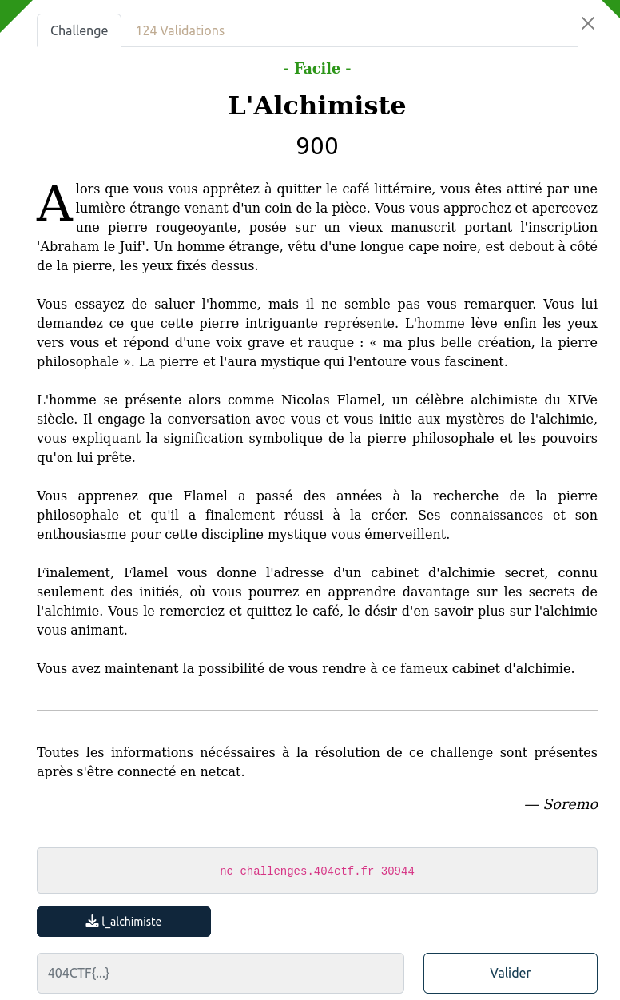

## PWN / L'Alchimiste

<p align="center">
  
</p>


### Look around

Le binaire du challenge est fourni : [l_alchimiste](files/l_alchimiste)

Niveau sécurités :

```bash
Arch:     amd64-64-little
RELRO:    Full RELRO
Stack:    Canary found
NX:       NX enabled
PIE:      No PIE (0x400000)
```

Pas de PIE, les portions de codes seront à des adresses connues en mémoire.

### Fonctionnalités

A l'exécution, une structure `joueur` est créée :

```c
int * createCharacter(int FOR,int INT,int OR)

{
  int *joueur;

  joueur = (int *)malloc(0x18);
  *joueur = FOR;
  joueur[1] = INT;
  joueur[2] = OR;
  *(undefined8 *)(joueur + 4) = 0;
  return joueur;
}
```

Et initialisée avec les paramètres:
- FOR = 100
- INT = 50
- OR = 100

Différentes fonctions peuvent être appelée, pour acheter de l'élixir, le consommer, et.

On se doute vite qu'il va falloir appeler `view_flag()`, mais pour obtenir le flag, il faut que notre personnage possède :
- FOR >= 150
- INT >= 150

### Exploit

Dans gdb, on peut regarder la structure en mémoire et son évolution avec différentes entrées. Je vais passer assez vite.

### Augmenter la FORCE

Pour ça on peut acheter un élixir

```c
void buyStrUpPotion(long joueur){
  long *elixir;

  puts(&DAT_00400dc8);
  elixir = (long *)malloc(0x48);
  printf("***** ~ %p\n",elixir);
  *elixir = 0x6420726978696c45;
  elixir[1] = 0x6563726f662065;
  elixir[8] = (long)incStr;
  if (*(int *)(joueur + 8) < 0x32) {
    puts(&DAT_00400df8);
  }
  else {
    *(long **)(joueur + 0x10) = elixir;
    *(int *)(joueur + 8) = *(int *)(joueur + 8) + -0x32;
  }
  return;
}
```

Si on a assez d'argent, un pointeur vers "l'élixir" est ajouté dans la structure `joueur`.

Ensuite on peut appeler la fonction `useItem()` pour consommer cet élixir :

```c
void useItem(long joueur){
  if (*(long *)(joueur + 0x10) == 0) {
    puts(&DAT_00400e38);
  }
  else {
    puts(&DAT_00400e7f);
    puts("***** Vous sentez votre force augmenter.");
    (**(code **)(*(long *)(joueur + 0x10) + 0x40))(joueur);
    printf("***** ~ %p\n",*(undefined8 *)(joueur + 0x10));
    free(*(void **)(joueur + 0x10));
  }
  return;
}
```

Elle vérifie qu'on a bien un élixir (ie le pointeur précédent), à la fin le `free()` libère l'emplacement mémoire utilisé par l'élixir, mais ne le remet pas à null, il est donc toujours présent dans la structure `joueur`.

Problème, si on consomme à nouveau un élixir, on a un double free et le programme crash.

En revanche, on peut appeler `sendMessage()`

```c
void sendMessage(void){
  void *__buf;

  __buf = malloc(0x48);
  printf("\n[Vous] : ");
  read(0,__buf,0x48);
  printf("***** ~ %p\n",__buf);
  return;
}
```

Qui alloue aussi une zone mémoire pour recevoir notre message, comme la zone précédemment utilisée pour l'élixir est considérée comme libre, elle va être utilisée.

On fait ça 5 fois de suite et on augmente les points de FORCE.


### Augmenter l'INTELLIGENCE

L'idée est la même, mais en plus on va écraser le pointeur vers `incStr()` par l'adresse de `incInt()`

### FLAG

Le code complet [exploit.py](files/exploit.py)

```bash
$ python3 exploit.py REMOTE
[+] Opening connection to challenges.404ctf.fr on port 30944: Done
[Alchimiste] : Voici la clé de la connaissance, comme promis.
-----------------------------------------------
404CTF{P0UrQU01_P4Y3r_QU4ND_135_M075_5UFF153N7}

-----------------------------------------------

[*] Closed connection to challenges.404ctf.fr port 30944
```
