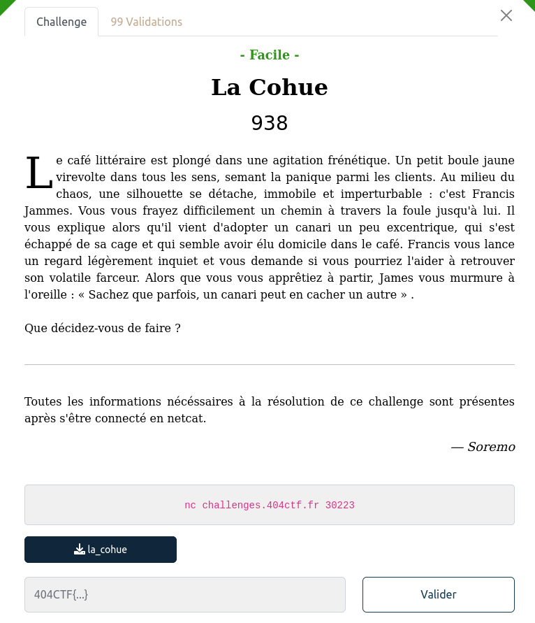

## PWN / La Cohue

<p align="center">
  
</p>


### Look around


Le binaire du challenge : [la_cohue](files/la_cohue)


Les sécurités :

```bash
    Arch:     amd64-64-little
    RELRO:    Full RELRO
    Stack:    Canary found
    NX:       NX enabled
    PIE:      No PIE (0x400000)
```


En regardant le code on remaque que la fonction `canary()` permet d'afficher le flag :

```c
void canary(void){
  FILE *__stream;
  long in_FS_OFFSET;
  char flag [72];
  long canary;

  canary = *(long *)(in_FS_OFFSET + 0x28);
  puts(&DAT_00400b98);
  __stream = fopen("flag.txt","r");
  fgets(flag,0x48,__stream);
  puts(flag);
  fclose(__stream);
  if (canary != *(long *)(in_FS_OFFSET + 0x28)) {
                    /* WARNING: Subroutine does not return */
    __stack_chk_fail();
  }
  return;
}
```

Y a plus qu'à l'appeler.

On a une format string vulnérable dans l'option `2`
```c
fgets(user_says,0x40,stdin);
...
printf(user_says);
...
```

Qui va nous permettre de faire fuiter la stack, et le canary de la protection de stack, puis avec l'option `1` une autre vulnérabilité va nous permettre d'écrire plus que nécessaire sur la stack, pour écraser jusqu'à la sauvegarde de l'adresse de retour de la fonction

```c
fgets(user_says,0x40,stdin);
gets(user_says);
```

En prenant soin d'écraser le canary par lui même.

### FLAG

Le code complet : [exploit.py](files/exploit.py)

```bash
$ python3 exploit.py REMOTE

[+] Opening connection to challenges.404ctf.fr on port 30223: Done
b'404CTF{135_C4N4r15_41M3N7_14_C0MP46N13_N3_135_141553Z_P45_53U15}\n'
[*] Closed connection to challenges.404ctf.fr port 30223
```
